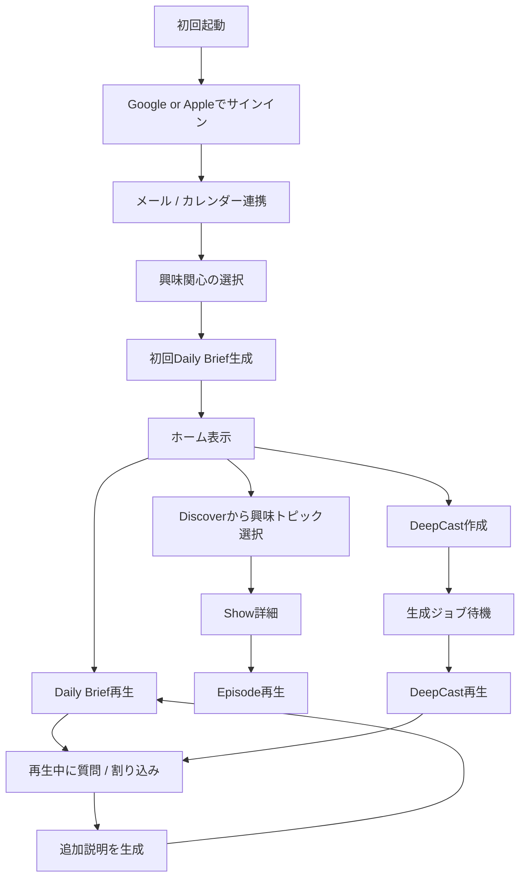
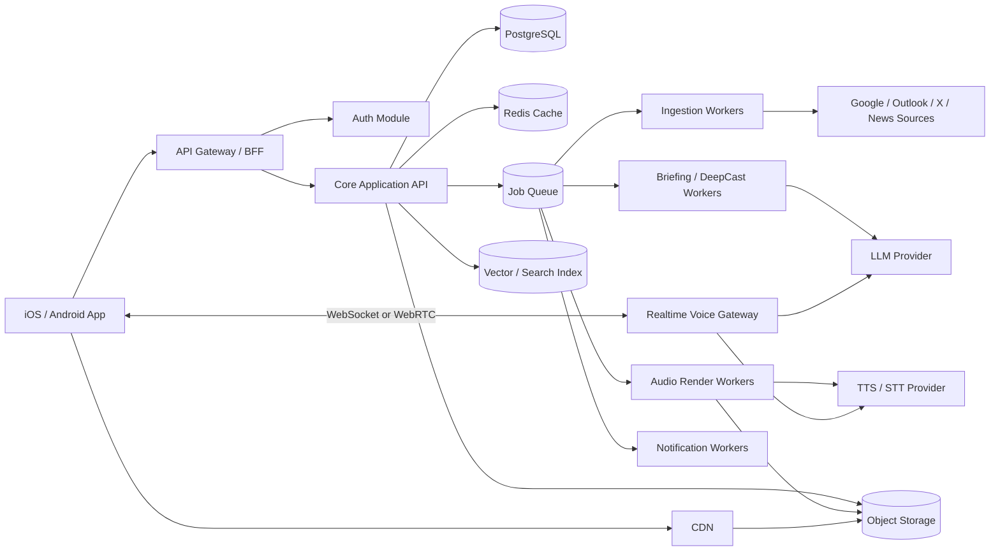
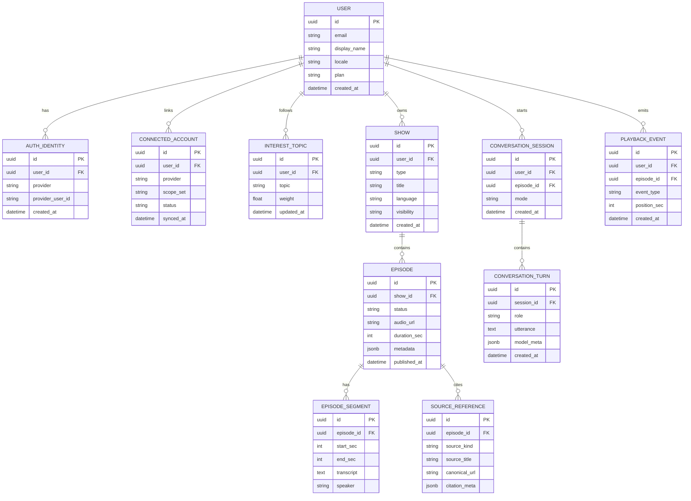

# Huxe アプリ 調査仕様レポート

## エグゼクティブサマリー

Huxe は、**メール・カレンダー・興味関心・周辺情報を、個人向けの音声インテリジェンスに変換する**ことを中核価値に置く、音声ファーストのAIアプリである。公式サイト、公式ブログ、App Store、Google Play の説明を突き合わせると、プロダクトの核は **Daily Briefings**、**Personalized Feed**、**DeepCast**、**Interactive Intelligence** の四本柱で整理できる。通勤・運動・画面休憩のような「目を使えない時間」に、ユーザー固有の情報を音声で再構成し、途中で質問・方向転換までできる点が、単なるTTSアプリや要約アプリとの差分になっている。citeturn4view0turn7view0turn43view0turn10view0

事業面では、Huxe は**現時点では無料提供**だが、利用規約では将来のサブスク化やプレミアム機能導入の可能性が明記されている。また、公式更新履歴からは、2025年6月以降に **CarPlay、X連携、Outlook接続、音声プレビュー、多言語、Live Stations、Shows & Episodes、チャプター、連続再生、Daily Brief刷新** などが短期間で追加されており、プロダクトは強く進化中の段階だと読める。citeturn37view2turn37view3turn26view0turn26view1

実装方針としては、公開情報から確認できる要件が **「個人データ接続」「非同期生成」「音声ストリーミング」「会話割り込み」「多言語」「メディアキャッシュ」** にまたがるため、**初期はモジュラモノリス + 非同期ワーカー群 + リアルタイム音声ゲートウェイ**が最も実務的である。マイクロサービスを最初から全面採用するより、機能変化の速さに追従しやすく、障害点も少なくできる。公開ストアレビューでは、再生開始遅延、音声の途切れ、ローカライズ反映の遅れ、表示同期のズレなどが見られるため、技術仕様では**ジョブ制御、キャッシュ、再試行、観測性**を厚く設計するのが妥当である。citeturn26view0turn15view1turn7view2

本レポートの結論を一言で言えば、**Huxe は「NotebookLM系のAI音声要約」よりも、もっと生活導線と個人コンテキストに踏み込んだ“パーソナルAIラジオ”であり、競争優位の源泉は個人信号の統合とインタラクティブ音声UXにある**。そのため仕様設計では、LLMやTTSの品質そのもの以上に、**接続アカウントの権限設計、ソース抽出、ジョブオーケストレーション、再生中介入の低遅延化、説明責任のあるデータ保護**を重視すべきである。citeturn43view0turn7view0turn10view0turn42view0turn37view0

## 概要と前提

### 調査前提

本レポートのうち、**Huxe の概要・機能・更新履歴・利用条件・データ取扱い**は公式情報を優先して整理した。いっぽう、**バックエンド設計、API、データモデル、技術スタック、コスト、工数**は公開情報が存在しないため、公式に確認できる要件を起点にした**推奨仕様案**である。特に後半は、「Huxe を同等以上の品質で再実装する/新規構築するならどう設計するか」という前提の設計提案として読むのが適切である。citeturn4view0turn43view0turn26view0turn42view0

### 公式情報の要約

| 項目 | 確認内容 |
|---|---|
| 製品の位置づけ | Huxe は「daily information を personalized audio intelligence に変換する」アプリとして公式サイト・ストアで説明されている。ブログでは「personal intelligence system」「radio made for you」と位置づけられている。 citeturn4view0turn7view0turn43view0 |
| 主要価値 | Daily Briefing、Personalized Feed、DeepCast、Interactive Intelligence が中心。音声はその場で生成・更新され、途中介入が可能。 citeturn7view0turn10view0 |
| 提供プラットフォーム | 公式サイトには App Store / Google Play への導線があり、App Store では iPhone・iPad、Google Play では Android 向けとして配信されている。 citeturn4view0turn15view1turn7view0 |
| 開発元 | Huxe AI Inc.。Google Play にはサポート窓口、住所、メールが掲載されている。 citeturn15view1turn6view5 |
| 価格 | App Store 上は無料、利用規約でも「currently free to download and use」と明記。ただし将来の価格導入可能性も記載。 citeturn15view1turn37view2turn37view3 |
| 公式コミュニティ | 公式サイト・ブログには Discord、X への導線があり、LinkedIn 公式ページでも継続的な機能アップデートが公表されている。 citeturn4view0turn43view0turn10view0 |
| 現在のストア指標 | 調査時点で、Google Play は 4.5★ / 5万+ ダウンロード / 約1.2千レビュー、App Store 日本ストアは 4.2 / 278評価。 citeturn7view0turn15view1 |

### 仕様化における重要な留意点

Huxe の公開情報には、仕様検討上見逃せない差分がいくつかある。第一に、**年齢要件**は App Store で 18+ と表示され、利用規約・プライバシーポリシーでも 18歳未満の利用を想定していない。他方、Google Play のコンテンツレーティングは「全ユーザー対象」であり、ストア表示上のレーティングとサービス利用適格年齢には差がある。日本市場向けに再設計する場合は、**ストア年齢区分、利用規約、本人同意フロー**を整合させる必要がある。citeturn15view1turn37view0turn42view3turn7view0

第二に、**データ取扱いの説明**には定義差がある。Google Play の Data safety では「第三者と共有されるデータはありません」「送信中に暗号化」「削除リクエスト可」とされる一方、プライバシーポリシーでは広告・分析パートナーやサービス提供事業者への共有可能性、AIモデル改善への利用、米国外移転が記載されている。GoogleのData safety上の「share」と、プライバシーポリシー上の「service provider / analytics / advertising partners」は定義が異なりうるが、ユーザー視点では混乱しやすいため、再実装時は**接続アカウント由来データ・解析データ・広告計測データを分離して説明する**のが望ましい。citeturn7view2turn42view0turn42view1

第三に、Huxe は短い期間で多くの追加機能を出している。これはポジティブには学習速度の高さだが、アーキテクチャ面では **高頻度な仕様変更に耐える構造**が必要であることを意味する。したがって、過度に硬直した分散設計より、**ドメイン分割されたモジュラモノリス**から始める判断に合理性がある。citeturn26view0turn10view0

## 機能一覧とUXフロー

### 主要機能マップ

| 機能 | 公式確認内容 | 仕様上の意味 |
|---|---|---|
| Daily Briefing | メール、カレンダー、周辺情報をもとに朝の音声ブリーフィングを生成する。公式ブログでも「actual emails and calendar, synthesized and contextualized」と説明。 citeturn7view0turn43view0 | 連携データの定期収集、要約、優先順位付け、音声化、再生履歴管理が必要。 |
| Personalized Feed | 一般的なおすすめではなく、興味関心に基づく個別音声フィード。 citeturn7view0 | ユーザープロファイル、興味タグ、閲覧/再生行動によるパーソナライズが必要。 |
| DeepCast | 任意トピックをその場でポッドキャスト化。 citeturn7view0turn10view0 | オンデマンド検索・要約・台本生成・音声合成のジョブパイプラインが必要。 |
| Interactive Intelligence | 再生中に割り込み、深掘り・簡略化・方向転換が可能。 citeturn7view0turn10view0 | 低遅延の音声入力、会話状態管理、途中差し替え再生が必要。 |
| Generative UI | 再生内容に応じて、画面上の引用・ビジュアル・ハイライトが変化する。 citeturn10view0 | 音声再生と同期するタイムライン/チャプターイベント配信が必要。 |
| Live Stations | 常に新しいコンテンツを流すライブ型のシリーズ。公式ブログ・更新履歴に記載。 citeturn43view0turn26view0 | トピックごとの継続更新ジョブ、重複除去、シリーズ管理が必要。 |
| Shows & Episodes | App Store 更新履歴に導入記録あり。 citeturn26view0 | エピソード単位の保存・再訪・共有・チャプター管理に発展。 |
| Voice Library | 音声ライブラリ拡張とプレビュー機能が公式LinkedIn/更新履歴に記載。 citeturn10view0turn26view0 | 話者プロファイル、音声品質比較、ユーザー選択記憶が必要。 |
| Multi-language | 公式LinkedInで対応、更新履歴でも言語追加。 citeturn10view0turn26view0 | 言語別TTS、UIローカライズ、ソース要約言語制御が必要。 |
| Outlook / Shared Calendar / X Linking / CarPlay | 更新履歴に追加実績あり。 citeturn26view0 | コネクタ抽象化、共有カレンダー権限、OS連携、外部リンク埋め込みが必要。 |

### 主要画面と操作

下表の「画像」列は、**公式ストア掲載スクリーンショットへの参照**である。

| 画面 | 画像 | 画面要素の読み取り | 主要操作 |
|---|---|---|---|
| ホーム | Google Play 掲載ホーム画面 citeturn13view2 | 上部に Daily Brief のヒーロー、中央に再生ボタン、下部に「Keep listening」カード群、タブと追加ボタンがある。 | 今日のブリーフ再生、過去/関連エピソードへの遷移、作成導線への移動。 |
| Daily Brief 詳細 | Google Play 掲載詳細画面 citeturn13view3 | 「Good Morning Ava」ヘッダの下に、イベント数・新着メール数とみられる指標カード、ソース別の項目カード、再生コントロールがある。 | 今日の予定確認、メール起点の確認、連続再生、途中停止。 |
| Discover / 興味関心フィード | Google Play 掲載 Discover 画面 citeturn13view4 | 「Traveling」「Sports」などのカテゴリカードが並び、ユーザーの興味別に音声コンテンツ候補を提示している。 | トピック探索、カテゴリ選択、番組詳細への遷移。 |
| Show 詳細 | Google Play 掲載 Show 詳細 citeturn13view5 | カバー画像、番組タイトル、作成日時、説明、エピソード一覧が確認できる。 | Show 再生、エピソード生成、詳細確認。 |
| Interactive Intelligence | Google Play 掲載会話画面 citeturn13view6 | 再生中のテキスト表示、トピック切り替え/タブ、中央の「Listening」状態などから、再生中介入型の会話UIが示唆される。 | 再生中の割り込み、問い返し、別の切り口への分岐。 |
| DeepCast 作成 | Google Play 掲載 DeepCast 作成画面 citeturn13view7 | 入力欄、トーン選択、公開範囲、生成ボタンがあり、トピック起点の即時番組生成フローを持つ。 | 新規トピック入力、生成モード選択、エピソード作成。 |

### UXフローの推奨整理

Huxe の核体験は、実務上は次の三つのユーザーフローに分解すると設計しやすい。

1. **オンボーディング → アカウント作成 → データ接続 → Daily Brief 初回生成**
2. **ホーム → Daily Brief 再生 → ソース確認 → 再生中質問**
3. **DeepCast 作成 → 生成待ち → 再生 → 保存/再訪**
   
この三系統がプロダクトの価値をほぼ説明している。特に Huxe は「画面を眺めさせるより、音声の中断なき体験を優先する」設計思想が強く、Generative UI はあくまで補助レイヤーとして見た方が自然である。これは公式ブログの「Not another notification. Not another feed.」「Audio that exists because you do.」という表現とも整合する。citeturn43view0turn10view0



### UX上の改善優先ポイント

非公式情報ではあるが、公式ストアレビューには **生成待ちの長さ、再生の途切れ、日本語反映の不安定さ、画面の黒化・フリーズ、UI同期のズレ** が複数見られる。Huxe の価値は「ながら視聴の滑らかさ」にあるため、UX優先度としては **見た目の派手さよりも、再生体験の安定性・復帰性・待ち時間短縮** を先に解決すべきである。仕様化するなら、音声ジョブの事前生成、部分キャッシュ、再接続、ローカルキュー、フォールバック音声、再生位置復元を MVP から必須要件に入れるべきである。citeturn7view2turn15view1

## 競合分析

### 比較対象の考え方

Huxe の真の競合は、単なる「読み上げアプリ」ではなく、**個人データやニュース・Webソースを音声体験に変換し、学習・把握・更新の手間を下げるアプリ群**である。その観点で、近接度の高い順に **CustomPod、NotebookLM、Particle、Matter、ElevenReader** を比較対象にした。CustomPod は「自分用ポッドキャスト型ニュース/情報ブリーフ」、NotebookLM は「ソース根拠つきAI音声研究」、Particle は「音声ニュース＋質問」、Matter と ElevenReader は「音声で読む」文脈での代替である。citeturn23view0turn23view1turn20view0turn25view0turn19view2turn19view1

### 比較表

| サービス | 主な機能 | 料金モデル | ターゲット | プラットフォーム | Huxeとの差別化ポイント |
|---|---|---|---|---|---|
| **Huxe** | Daily Brief、Personalized Feed、DeepCast、再生中割り込み、Live Stations、Shows/Episodes、多言語、音声選択、Outlook / X / CarPlay 連携など。 citeturn7view0turn10view0turn26view0 | 現在は無料。将来の課金導入可能性を規約で明記。 citeturn15view1turn37view2 | 情報過多の知識労働者、通勤・運動中に把握を進めたい層。 citeturn10view0turn43view0 | iPhone / iPad / Android。 citeturn15view1turn7view0 | **個人メール/カレンダーに最も深く食い込んだ音声UX** と、**再生中の会話介入**が最大の差分。 |
| **CustomPod** | Web / Slack / RSS / 検索 / ニュース由来のポッドキャスト型ブリーフ、深掘り、インスタントポッドキャスト。 citeturn23view0turn23view1 | 無料 + アプリ内購入。公式サイトは Free/Pro、App Store は月額課金あり。 citeturn19view3turn23view0 | 自分で情報源を束ねて音声化したいユーザー、ニュース/仕事チーム更新を耳で追いたい層。 citeturn23view0turn23view1 | iPhone / iPad / Android。 citeturn23view0turn23view1 | **概念的には最も近い**。ただし、Huxe の方が「個人の一日」への文脈統合と会話的介入が前面に出ている。 |
| **Google NotebookLM** | ソースアップロード、引用つき要約、質問応答、Audio Overviews、背景再生、オフライン再生。 citeturn20view0turn20view1 | 無料 + Google AI Plus / Pro などのIAP。 citeturn21view0turn21view2 | 学生、研究者、クリエイター、専門職など、資料を根拠つきで理解したい層。 citeturn20view0 | iPhone / iPad / Android。 citeturn20view0turn20view1 | Huxe は**受動的な生活情報の自動取り込み**に強く、NotebookLM は**ユーザーが持つ資料の能動的読解**に強い。 |
| **Particle** | 複数視点ニュース、政治的傾向表示、要約スタイル切替、ニュースの音声再生、質問応答、ポッドキャストクリップ。 citeturn24view2turn24view0turn25view0 | 無料 + 月額 / 年額の Particle+。 citeturn24view1 | ニュースを効率よく整理し、複数視点で把握したい読者。 citeturn24view2turn25view0 | iPhone / iPad / Android。 citeturn24view2turn25view0 | Huxe は**ニュース専用ではなく、個人情報・予定・興味まで含む**。Particle はニュース整理に特化。 |
| **Matter** | Read-later、ニュースレター同期、RSS/ライター購読、自然音声TTS、ハイライト、送信先連携。 citeturn19view2turn22view3 | 無料 + Premium / Pro。 citeturn22view0turn22view1turn22view2 | 長文記事やニュースレターを後で読みたいヘビーユーザー。 citeturn19view2turn22view3 | iPhone / iPad / Mac / Vision / Web。 citeturn19view2turn22view0 | Huxe は**「読むために保存する」より「いま知るべきことを自動で音声化する」**というプロアクティブ性が差分。 |
| **ElevenReader** | 書籍・PDF・記事・文書の高品質TTS、AI podcast summary、膨大な音声ライブラリ、多言語。 citeturn19view1 | 無料プラン + 有料 Ultra。 citeturn19view1 | TTS品質重視、読書・学習・アクセシビリティ用途のユーザー。 citeturn19view1 | iOS / Android / Chrome / Web。 citeturn19view1 | Huxe は**ソース選定や文脈化まで含めて先回りする**。ElevenReader は**聞かせ方**に強いが、情報発見はユーザー起点。 |

### 競争上の示唆

Huxe の差別化は、単に「AIがしゃべる」ことではない。**何を話すかを、ユーザーの一日・アカウント・興味関心から自動で決める**点にある。NotebookLM や ElevenReader は優れた音声化を持つがソース投入をユーザーに要求し、Particle はニュースに強いが私的コンテキストを持たない。CustomPod は最も近いが、Huxe は公式ブログやLinkedIn が示す通り、「毎朝の actual emails and calendar」から始める点でさらに生活に密着している。したがって、**Huxe の moat はモデルそのものではなく、個人シグナル統合 + 音声体験の一貫性**と整理できる。citeturn43view0turn10view0turn23view0turn20view0turn25view0turn19view1

## バックエンド設計

### アーキテクチャ判断

**推奨は「モジュラモノリス + 非同期ワーカー + リアルタイム音声ゲートウェイ」**である。フルマイクロサービスは、Huxe ほど仕様変化が激しい初期~成長期プロダクトには過剰投資になりやすい。App Store の更新履歴だけでも 2025年6月〜2026年2月に非常に多くの機能が追加されており、領域境界はまだ固まり切っていない。まずは単一コードベースで、**認証・接続アカウント・ブリーフ生成・DeepCast・再生・会話・請求**をモジュール分割し、**重い処理だけキュー駆動のワーカー**に逃がす方が設計変更に強い。citeturn26view0turn10view0

フルマイクロサービスへ移行すべきトリガーは、概ね **(a) 音声会話の低遅延要件が独立スケールを要する、(b) コネクタ追加が高頻度になり外部API障害が他機能に波及する、(c) チームが 8〜10名以上の複数スクワッドに分かれる** 辺りである。それまでは、**APIアプリ本体・ジョブワーカー・リアルタイムゲートウェイ**の三層で十分戦える。これは Huxe の現状機能に照らしても、最小構成として合理的である。citeturn7view0turn10view0turn26view0



### 主要コンポーネント

| コンポーネント | 役割 | 実装メモ |
|---|---|---|
| API Gateway / BFF | モバイルアプリ向け集約API。認証、レート制御、レスポンス整形。 | REST中心。再生系メタデータは低遅延重視。 |
| Auth Module | Google / Apple ログイン、セッション、デバイス認証。 | OAuth 2.0 / OIDC + PKCE、短命アクセストークン。 |
| Connector Module | Gmail / Google Calendar / Outlook / X などの接続・同期。 | Providerごとに adapter を分離。Webhook + pull の併用。 |
| Briefing Orchestrator | Daily Brief 生成の司令塔。ソース取得、重複除去、優先順位付け、要約、台本生成を連結。 | 非同期ジョブ化必須。 |
| DeepCast Composer | トピック起点の検索・リサーチ・脚本化。 | LLM呼び出しと検索拡張を分離。 |
| Realtime Voice Gateway | 再生中の割り込み会話、ASR/TTSストリーミング。 | 独立Pod/Serviceとして分離。 |
| Episode Service | Show / Episode / Segment / Transcript / Playback state 管理。 | S3音声URL、字幕、チャプターを返す。 |
| Personalization Engine | 興味関心、再生履歴、スキップ、フィードバックを学習。 | まずはルール + 埋め込み検索、後にML化。 |
| Notification Service | ブリーフ準備完了、失敗、リマインド通知。 | Push/APNs/FCM。 |
| Admin / Support | 強制再生成、接続状態調査、削除請求処理、監査確認。 | 本番データのマスキング必須。 |

### API設計の推奨

#### 認証方式

- **ユーザー認証**: Google / Apple の OIDC、OAuth 2.0 Authorization Code + PKCE  
- **アプリ認可**: Access Token は JWT 15分、Refresh Token はローテーション方式  
- **接続アカウント認可**: Gmail / Calendar / Outlook などは別途 provider token vault に保管  
- **管理者アクセス**: RBAC + Just-in-time elevation  
- **リアルタイム会話**: 初回は REST で session 作成、以後 WebSocket か WebRTC DataChannel を利用

この設計は、Huxe の規約が **Google Restricted Scopes は最小権限で取得する** と明記し、Google / Apple サインインと外部サービス接続を前提にしていることとも整合する。citeturn37view0

#### エンドポイント例

| Method | Endpoint | 用途 | 認証 |
|---|---|---|---|
| `POST` | `/v1/auth/oidc/google/start` | Googleログイン開始 | 公開 |
| `POST` | `/v1/auth/oidc/apple/start` | Appleログイン開始 | 公開 |
| `GET` | `/v1/me` | プロフィール取得 | User |
| `POST` | `/v1/connections/google` | Gmail / Calendar 接続 | User |
| `POST` | `/v1/connections/outlook` | Outlook 接続 | User |
| `GET` | `/v1/briefings/today` | 今日のDaily Brief取得 | User |
| `POST` | `/v1/briefings/generate` | 再生成要求 | User |
| `GET` | `/v1/feed` | Personalized Feed取得 | User |
| `POST` | `/v1/deepcasts` | DeepCast生成ジョブ作成 | User |
| `GET` | `/v1/shows/{showId}` | Show 詳細取得 | User |
| `GET` | `/v1/episodes/{episodeId}` | Episode 詳細取得 | User |
| `POST` | `/v1/episodes/{episodeId}/session` | 再生セッション発行 | User |
| `POST` | `/v1/voice/sessions` | 割り込み会話セッション開始 | User |
| `POST` | `/v1/feedback` | Like / Skip / Too long など | User |
| `DELETE` | `/v1/account` | アカウント削除要求 | User |

#### レスポンス例

**DeepCast 生成要求**

```json
POST /v1/deepcasts
{
  "title": "日本のAIエージェント市場の現状を教えて",
  "language": "ja-JP",
  "tone": "research",
  "visibility": "private",
  "duration_target_sec": 480
}
```

**生成受付レスポンス**

```json
{
  "job_id": "job_01JXYZ...",
  "show_id": "show_01JXYZ...",
  "status": "queued",
  "estimated_ready_in_sec": 25
}
```

**Episode 取得レスポンス**

```json
{
  "episode_id": "ep_01JXYZ...",
  "show_id": "show_01JXYZ...",
  "type": "deepcast",
  "title": "日本のAIエージェント市場",
  "audio": {
    "stream_url": "signed-cdn-url",
    "duration_sec": 502,
    "waveform_url": "signed-waveform-url"
  },
  "chapters": [
    { "start_sec": 0, "title": "市場概観" },
    { "start_sec": 145, "title": "主要プレイヤー" },
    { "start_sec": 312, "title": "導入課題" }
  ],
  "sources": [
    {
      "source_id": "src_01",
      "title": "Official source item",
      "kind": "news",
      "url": "masked-or-signed-reference"
    }
  ],
  "interaction": {
    "can_interrupt": true,
    "voice_session_id": "vs_01JXYZ..."
  }
}
```

#### リアルタイム会話メッセージ例

```json
{
  "type": "interrupt",
  "voice_session_id": "vs_01JXYZ...",
  "episode_id": "ep_01JXYZ...",
  "utterance": "もう少し簡単に説明して",
  "playback_position_sec": 188
}
```

```json
{
  "type": "assistant_patch",
  "voice_session_id": "vs_01JXYZ...",
  "new_segment": {
    "insert_after_sec": 188,
    "audio_chunk_url": "signed-chunk-url",
    "transcript": "ここでは専門用語を使わずに説明します。"
  }
}
```

### データモデル

Huxe の公開情報から逆算すると、最低限必要な中核エンティティは **User / ConnectedAccount / Interest / Show / Episode / SourceReference / Conversation / PlaybackEvent** である。Daily Brief、DeepCast、Live Stations は「番組タイプ」の違いで吸収し、エピソード単位で音声・字幕・出典を持たせると拡張しやすい。citeturn7view0turn43view0turn26view0



### スケーラビリティ、キャッシュ、キュー、ストレージ、CI/CD、監視

#### スケーラビリティ

Huxe 型アプリは、**書き込みが重いサービス**ではなく、**生成時負荷が重い read-heavy** サービスである。ボトルネックは通常のCRUDではなく、**(a) ソース収集、(b) LLM要約、(c) TTS合成、(d) 再生中介入**に集中する。したがって、水平スケール対象は API 本体よりも **ワーカー群とリアルタイム音声ゲートウェイ**になる。公式機能を見る限り、Live Stations や DeepCast、Shows/Episodes は非同期ジョブとの相性が良い。citeturn43view0turn26view0

#### キャッシュ

キャッシュ戦略は三層に分けるべきである。

1. **メタデータキャッシュ**: `today briefing`, `feed`, `show summary` を Redis に 1〜10分  
2. **音声キャッシュ**: 生成済み音声ファイルを Object Storage + CDN に配置  
3. **LLM結果キャッシュ**: 同一プロンプト/同一ソースセットに対する再利用

音声ファイルを保存して再生を繰り返せば、合成コストは再生回数ではなく**初回合成時だけ**で済む。これは Amazon Polly のバルク合成運用でも強調されている。citeturn39search12turn29search8turn30search10

#### キュー

キューは必須であり、少なくとも次のイベントを分離すべきである。

- `SYNC_CONNECTED_ACCOUNT`
- `BUILD_DAILY_BRIEF`
- `BUILD_DEEPCAST`
- `RENDER_AUDIO`
- `EMIT_NOTIFICATION`
- `REFRESH_LIVE_STATION`
- `PROCESS_VOICE_INTERRUPT`

SQS のようなマネージドキューは、最初の 100万リクエスト/月が無料で、その後も従量課金で始めやすい。Huxe 型のジョブ量なら MVP ではキューコストは小さい。citeturn33search0turn33search10

#### ストレージ

- **RDB**: PostgreSQL（ユーザー、接続、エピソード、課金、権限）
- **Object Storage**: MP3/AAC、波形JSON、字幕JSON、cover画像
- **Search / Vector**: `pgvector` か OpenSearch。ソース検索と類似トピック推薦に利用
- **Cold Storage**: 生ログ・古い音声はライフサイクルで低コスト層へ移行

Huxe ほど音声中心だと、S3系のオブジェクトストレージは事実上の中心コンポーネントになる。Amazon S3 は大規模スケールと高可用性を前提としたオブジェクト保存基盤として設計されている。citeturn29search8turn29search5

#### CI/CD

推奨は、**GitHub Actions → コンテナビルド → ECR → ECS/Fargate へ Blue/Green デプロイ**である。ECS / Fargate はコンテナ運用との親和性が高く、AWS 公式でも Blue/Green 運用のプラクティスが整備されている。citeturn30search7turn29search9

#### 監視

最低限、以下を監視対象にする。

- API p95 / p99 latency
- Daily Brief 生成成功率
- DeepCast 生成時間
- TTS 成功率
- voice interrupt response time
- provider 別トークン失効率
- 再生開始失敗率
- アプリクラッシュ率
- キュー滞留時間
- 1ユーザーあたりモデルコスト

CloudWatch はログ、メトリクス、アラームを従量課金で始められる。ログ取り込みやカスタムメトリクスが増えるとコストが伸びるため、**PIIマスキング + サンプリング + 保持期間管理**が重要になる。citeturn31search4turn31search1

## 技術スタック候補と概算コスト

### 推奨スタック

| レイヤ | 推奨 | 代替 | 判断理由 |
|---|---|---|---|
| モバイル | **React Native + ネイティブ音声モジュール** | SwiftUI / Kotlin Compose の完全ネイティブ | iOS/Android 同時展開の速度を優先しつつ、音声再生・録音・ロックスクリーン制御・CarPlay級連携だけネイティブ拡張に逃がす。 |
| API | **TypeScript + NestJS** | Go / Kotlin / FastAPI | ドメインモジュール化しやすく、BFF・ジョブ定義・バリデーションに向く。 |
| 非同期ワーカー | **TypeScript Worker or Python Worker** | Go Worker | LLM / 音声処理周辺は Python 併用の柔軟性が高い。 |
| DB | **PostgreSQL** | Aurora PostgreSQL / Cloud SQL | ユーザー・接続・番組・権限・監査を一元管理しやすい。 |
| キャッシュ | **Redis** | Valkey / ElastiCache Serverless | フィード・セッション・一時ジョブ状態に最適。 |
| オブジェクトストレージ | **S3** | GCS / R2 | 音声ファイル、字幕、波形、画像配信の定番。 |
| キュー | **SQS** | RabbitMQ / Pub/Sub | シンプル、安価、運用負荷が低い。 |
| CDN | **CloudFront** | Fastly / Cloudflare | 音声配信のキャッシュと署名URLが組みやすい。 |
| 認証 | **OIDC + OAuth 2.0 + PKCE** | Clerk / Auth0 / Cognito | Google / Apple / Outlook 連携の中心。 |
| モデル | **Bedrock or vendor-agnostic LLM layer** | Vertex AI / OpenAI / Anthropic direct | Huxe型はモデル差し替え余地を残すのが重要。 |
| TTS / STT | **Polly + Transcribe を基準候補** | ElevenLabs / Google Cloud Speech | MVP の運用容易性とコスト予測を優先。 |

### コスト見積りの前提

以下は**日本市場向けのMVP〜β運用想定**の概算であり、公開価格のある AWS 料金ページと、音声処理の単価をもとにした**筆者試算**である。為替は **1 USD = 155円** の仮定を置く。モデル費は Bedrock などで**プロバイダーとモデルによって大きく変動**するため、基盤費と分けて示す。AWS の各サービスは概ね従量課金で、Fargate は vCPU 秒/GB 秒、RDS はインスタンス時間・ストレージ、SQS はリクエスト、S3/CloudFront はストレージ・転送、Polly は文字数、Transcribe は分数で課金される。citeturn32view0turn40search3turn33search0turn29search5turn30search10turn39search3turn39search7turn39search5

### 月額概算

| 項目 | 想定構成 | 月額概算 |
|---|---|---|
| API / Worker Compute | Fargate で API 2タスク常時稼働 + Worker 常時1〜2本 + バースト分 | **¥2万〜¥8万** |
| DB | PostgreSQL マネージド、β相当の小〜中サイズ、本番バックアップ込み | **¥3万〜¥10万** |
| Cache | Redis 小〜中サイズ | **¥1万〜¥4万** |
| Storage / CDN | 音声・字幕・画像 + 配信 | **¥5千〜¥3万** |
| Queue / Mail / Push / Secrets | SQS / SES / Secrets / KMS など | **¥5千〜¥2万** |
| Logging / Monitoring | CloudWatch Logs + メトリクス + アラーム | **¥1万〜¥5万** |
| **基盤小計** |  | **¥7.5万〜¥32万** |

この「基盤小計」は、Huxe 型アプリの本質である LLM と音声変換の費用をまだ含まない。ここに、利用量に応じて **AI従量費** が上乗せされる。citeturn32view0turn40search3turn31search4turn33search0turn29search5turn30search10

### 音声・モデル費の見方

Amazon Polly の公開単価では、100万文字あたり **Standard 4 USD / Neural 16 USD / Generative 30 USD / Long-Form 100 USD** が目安である。したがって、たとえば月 2,000万文字を Neural で合成すると **約320 USD（約5万円）**、Generative なら **約600 USD（約9.3万円）**になる。音声品質をどこまで求めるかで差が大きい。citeturn39search3

Amazon Transcribe は秒単位課金で、公式の米国東部参考値では初期 tier で **0.03 USD/分** の水準が示されている。会話割り込みが短い前提なら、STT費用は TTS や LLM に比べて相対的には軽いが、**常時待機のストリーミング設計**にすると一気に増える。したがって、MVP では「Push-to-talk」または「短時間の unmute 窓」を採る方が費用対効果が良い。citeturn39search1turn39search7

LLM コストは Bedrock の通り**モデルごとに別料金**であり、要約・検索・台本生成・会話補完・多言語変換をどこまで同一モデルで賄うかで大きく変わる。実務的には、**Daily Brief と Feed は軽量モデル、DeepCast と会話補完は高品質モデル**とし、音声はキャッシュ再利用で抑えるのが王道である。citeturn39search5turn39search12

### コスト結論

- **MVP基盤**: 月 **8万〜20万円** で十分始められる  
- **β運用基盤**: 月 **15万〜35万円** が現実的  
- **AI従量込み総額**: 利用量と音声品質により、月 **20万〜120万円超** まで振れる

Huxe 型アプリで本当に効くコスト最適化は、**音声の再合成回避、ソース重複除去、モデル階層化、長文DeepCastのバッチ生成**である。SQS・S3・CloudFront などの基盤単価は比較的読みやすく、**変動の主因は生成AI部分**にある。citeturn33search0turn29search5turn30search10turn39search3turn39search5

## セキュリティ・運用要件

### 認証・認可

Huxe の規約では、Google Restricted Scopes は**最小権限のみ要求**するとし、Google / Apple ログインや、職場・学校アカウント接続時の責任関係も明記している。よって再実装時は、**コネクタごとの scope 分割、接続理由の説明UI、利用停止時の revoke 導線**を必須にすべきである。特に仕事用アカウントは「接続してよい権限があるか」をユーザーに確認させ、監査ログに残す必要がある。citeturn37view0

推奨要件は以下の通りである。

| 項目 | 推奨要件 |
|---|---|
| User Auth | Google / Apple OIDC、PKCE、MFA任意対応 |
| Session | JWT 15分 + ローテーション Refresh Token |
| Admin | RBAC、JIT昇格、IP制限 |
| Connector Auth | provider 別 encrypted token vault、scope最小化 |
| Resource AuthZ | すべて `user_id` ベースの ownership check |
| Abuse Control | デバイス指紋、IP rate limit、異常使用検知 |

### データ保護

Huxe のプライバシーポリシーでは、**プロフィール、会話、メール/テキスト、写真/動画、音声、接続アカウント由来データ**を収集し、サービス提供・パーソナライズ・改善・AIモデル訓練・マーケティングに利用しうること、さらに広告・分析パートナー、米国外移転の可能性が記載されている。再仕様化するなら、ここはかなり慎重に再設計すべきである。特に日本市場では、**接続アカウント本文、録音音声、会話ログ**は高センシティブ扱いとして、暗号化・最小保存・学習オプトアウトを入れるのが望ましい。citeturn42view0turn42view1

推奨データ保護要件は次の通りである。

| 項目 | 推奨要件 |
|---|---|
| 通信 | TLS 1.2+、モバイル証明書ピンニング任意 |
| 保存 | DB / Object Storage ともに KMS による暗号化 |
| フィールド保護 | メール件名/本文断片、カレンダー概要、音声文字起こしはアプリ層で追加暗号化 |
| シークレット | Secret Manager / KMS で集中管理、環境変数直置き禁止 |
| 学習制御 | 「サービス改善」「モデル訓練」「広告計測」をユーザー設定で分離 |
| エクスポート/削除 | 全接続データの削除要求と処理中ステータスを表示 |

### ログ、バックアップ、SLA

Huxe の公式ポリシーでは、**音声録音と会話トランスクリプトはアカウント閉鎖後最大90日、分析ログは最大12か月** 保持するとしている。これをそのまま踏襲してもよいが、日本市場での信頼を優先するなら、**会話ログは30〜90日、分析ログは90〜180日で短く持つ**ほうが受け入れられやすい。citeturn42view3

運用要件としては、次の水準を推奨する。

| 項目 | MVP | GA |
|---|---|---|
| 可用性目標 | 99.5% | 99.9% |
| RPO | 24時間以内 | 15分以内 |
| RTO | 8時間以内 | 4時間以内 |
| DBバックアップ | 毎日 full + PITR | PITR + cross-region copy |
| Object Storage | versioning 有効 | versioning + lifecycle + DR複製 |
| 監査ログ保持 | 180日 | 365日 |
| インシデント通知 | アプリ内 + ステータスページ | ステータスページ + メール + webhook |

### 日本市場向けの制度要件

日本市場向けに展開する場合、個人情報保護委員会のガイドライン上、**安全管理措置の明示**と、**外国にある第三者への提供 / 海外移転時の説明**が重要になる。Huxe 自身も、米国外からアクセスする場合にはデータが米国その他の国で処理される可能性と、必要な保護措置を講じる旨を記載している。したがって日本向け仕様では、**移転先国、保護制度、取っている安全管理措置、接続先データの扱い、委託先一覧のカテゴリ説明**を、設定画面またはポリシー画面から参照可能にするべきである。citeturn42view1turn28search0turn28search5turn28search3

## 実装見積りと参考ソース

### MVP定義

Huxe の全機能を一度に再現するのではなく、**「朝の情報整理」と「任意トピックの音声深掘り」**に絞って MVP を定義するのが現実的である。

| 優先度 | MVPに含める内容 |
|---|---|
| Must | Google / Appleログイン、Google Calendar / Gmail 連携、興味関心設定、Daily Brief生成、DeepCast生成、音声再生、再生中のテキストUI、簡易割り込み会話、通知、削除要求、ログ/監視 |
| Should | Outlook連携、音声選択、チャプター、連続再生、保存済みShow一覧、再生速度変更 |
| Could | Live Stations、X連携、CarPlay、共有カレンダー、複数話者の高度チューニング、詳細なレコメンド学習 |

この切り方なら、Huxe の「個人情報を音声で整理する」という本質を落とさずに、外部連携と音声UXの難所を絞り込める。実際の Huxe も、更新履歴を見ると Outlook、多言語、Voice Preview、Live Stations、Shows/Episodes、CarPlay などを段階的に足している。citeturn26view0

### 開発工数の目安

| フェーズ | 主タスク | 概算人月 |
|---|---|---:|
| 企画・設計 | 要件定義、情報設計、同意設計、画面設計、アーキ方針 | 1.5〜2.5 |
| 基盤構築 | 認証、DBスキーマ、CI/CD、監視、Secrets、環境分離 | 2.0〜3.0 |
| コネクタ | Google OAuth、Calendar/Gmail 同期、ジョブ基盤 | 2.5〜4.0 |
| Daily Brief | ソース抽出、優先順位付け、台本生成、音声化 | 3.0〜4.5 |
| DeepCast | 検索、要約、番組生成、出典管理 | 2.5〜4.0 |
| プレーヤーUX | 再生、字幕、状態復元、通知、バックグラウンド再生 | 2.5〜3.5 |
| 会話機能 | tap-to-speak、STT/TTS、途中差し替え、会話状態管理 | 3.0〜4.5 |
| QA・セキュリティ | 負荷試験、障害試験、削除試験、レビュー対応 | 1.5〜2.5 |
| β運用準備 | アナリティクス、運用Runbook、サポート画面、リリース準備 | 1.0〜2.0 |
| **合計** |  | **19.5〜30.5 人月** |

### 体制とスケジュール感

推奨体制は、**PdM 1、デザイナー 0.5〜1、モバイル 2、バックエンド 2、ML/音声 1、QA 0.5、DevOps 0.5** の 6〜7名体制である。この場合、MVP は **4〜5か月**、β安定化まで入れると **5〜7か月** が現実的である。もしネイティブアプリを iOS / Android 別々にフル実装する場合は、さらに **+3〜5人月** を見ておくべきである。

### 最終所見

Huxe を仕様として捉えると、これは「AIポッドキャストアプリ」ではなく、**個人データ、興味関心、ニュース/外部ソース、音声会話を横断する“パーソナル情報OS”の薄い第一形態**である。したがって再実装の成否は、LLMの賢さだけでなく、**同意設計・ソース統合・ジョブ制御・再生継続性・説明可能性・データ保護**にかかる。公開情報を見る限り、Huxe 自身もその方向に急速に拡張中であり、設計側は最初から**コネクタ追加と番組タイプ増加**に耐える構造を持たせるのが正しい。citeturn43view0turn10view0turn26view0turn42view0

### 参考ソース一覧

| 区分 | ソース | 用途 |
|---|---|---|
| 公式 | Huxe 公式サイト citeturn4view0 | 製品コンセプト、ストア導線、公式SNS導線 |
| 公式 | Huxe 公式ブログ「The Superpower of Knowing」 citeturn43view0 | 製品思想、Live Stations、個人メール/カレンダー文脈 |
| 公式 | Huxe App Store 日本ストア citeturn15view1turn26view1 | iOS配信、価格、年齢表示、説明文、更新履歴、レビュー |
| 公式 | Huxe Google Play ストア citeturn7view0turn7view2 | Android配信、説明文、ダウンロード規模、Data safety |
| 公式 | Huxe 利用規約 citeturn37view0turn37view2turn37view3 | 年齢要件、出力利用制限、将来課金、外部アカウント接続条件 |
| 公式 | Huxe プライバシーポリシー citeturn42view0turn42view1turn42view3 | 収集データ、保持期間、AI訓練、広告/分析、国外移転 |
| 公式準拠 | Huxe 公式LinkedIn 投稿 citeturn10view0 | Generative UI、音声ライブラリ、多言語、会話モード更新 |
| 公式画像 | Google Play 掲載スクリーンショット群 citeturn13view2turn13view3turn13view4turn13view5turn13view6turn13view7 | 主要画面のUI読解 |
| 公式 | Google NotebookLM 公式アプリ情報 citeturn20view0turn20view1turn21view0 | 競合比較 |
| 公式 | CustomPod 公式サイト / ストア情報 citeturn19view3turn23view0turn23view1 | 競合比較 |
| 公式 | Particle 公式ストア情報 citeturn24view0turn24view1turn24view2turn25view0 | 競合比較 |
| 公式 | Matter 公式サイト / ストア情報 citeturn19view2turn22view0turn22view1 | 競合比較 |
| 公式 | ElevenReader 公式サイト citeturn19view1 | 競合比較 |
| 公式 | 個人情報保護委員会ガイドライン等 citeturn28search0turn28search5turn28search3 | 日本市場向け制度要件 |
| 公式 | AWS 価格・運用関連資料 citeturn32view0turn40search3turn33search0turn29search5turn30search10turn31search4turn39search3turn39search7turn39search5turn29search9turn39search12 | 技術スタック候補、コスト概算、CI/CD・運用設計 |
| 日本語参考 | ASCII の日本語記事 citeturn14search28 | 日本語圏での受容状況の補足 |
| 日本語参考 | note の日本語レビュー記事 citeturn14search6 | 日本語圏での体験レビュー補足 |